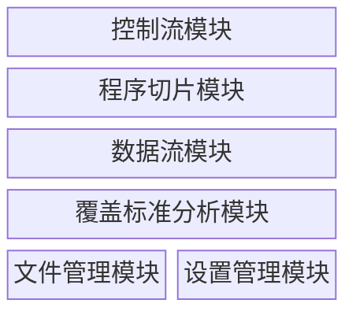
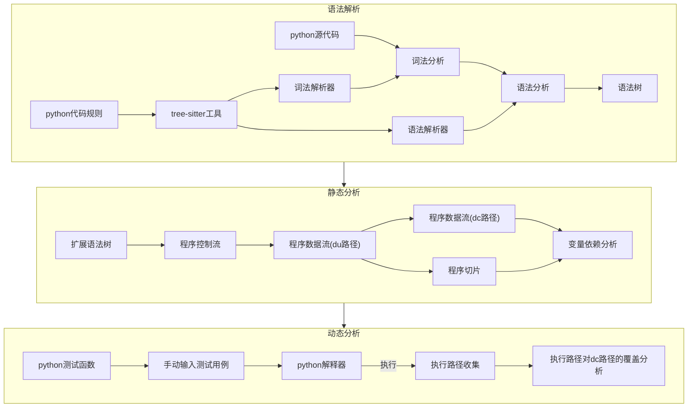
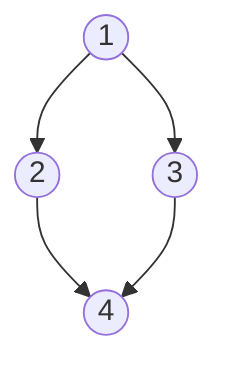
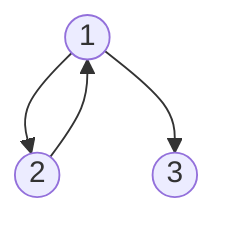
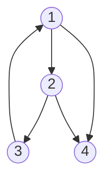
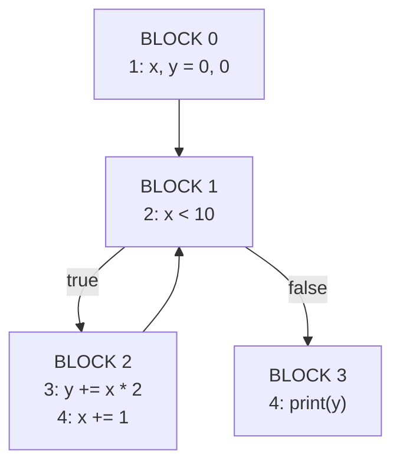
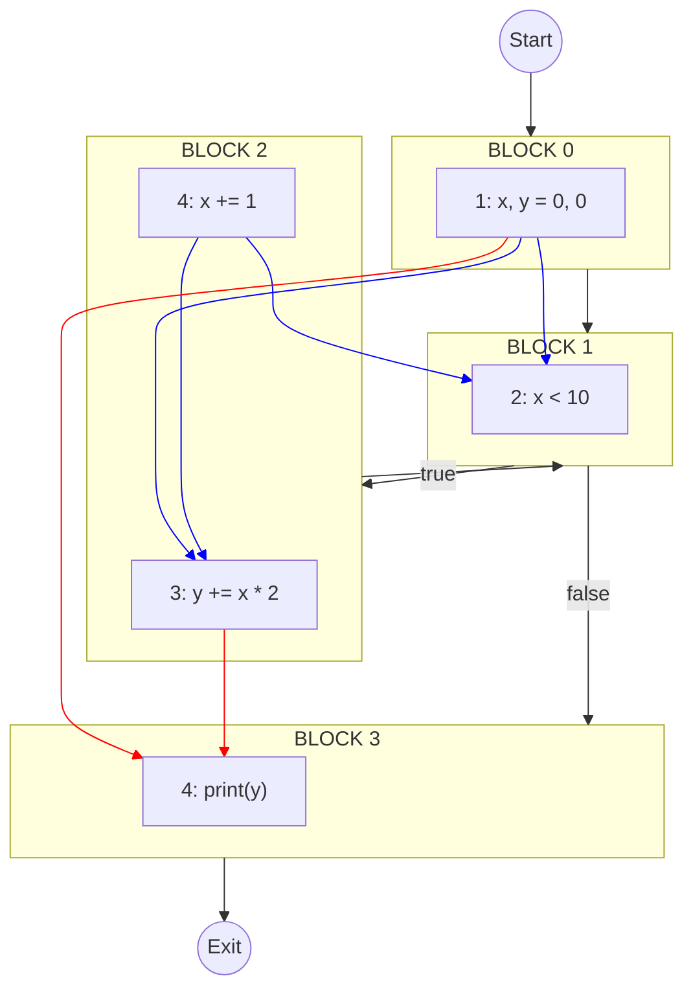
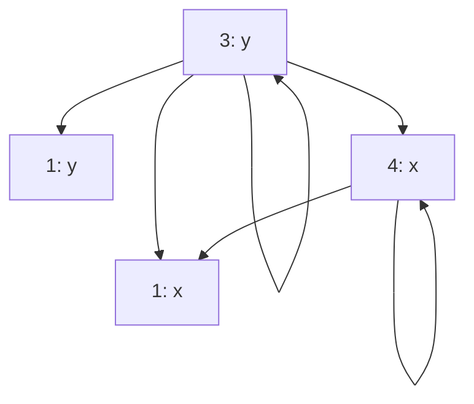

# 数据流和切片测试<br>工具的设计与实现

中期检查报告

阮中秋 19241030

2024.4.3


---

# 研究目标

基于数据流和切片测试思想，设计开发一个工具，能实现python代码高亮、可视化以及覆盖标准分析等功能，帮助学生理解数据流和切片测试的知识

- 任给一段代码，选中一个变量，可以按照切片测试思想，给出对应**代码片段高亮**
- 对如上高亮显示代码用图的形式绘制出方法和变量的包含关系，变量和变量的支持关系，等其他**可视化关系**
- 对数据量测试，给定一个变量，分别显示方法中变量的**定义和使用代码行**，并给出**dc路径的绘制**
- 任给一个测试用例，判断是否满足数据流测试的几种**覆盖标准**

---
level: 2
---

# 功能需求分析

<div class="grid grid-cols-2 gap-5">
<div>
<h4>用例图</h4>

</div>
<div>
<h4>功能模块划分</h4>
<div class="mt-10">

</div>

</div>

</div>

<style>
h4 {
  opacity: 0.7
}
</style>

---
level: 2
---

# UI设计

<div class="w-full flex justify-center">

</div>

<arrow  x1="110" y1="210" x2="175" y2="234" color="#953" width="2" arrowSize="1" />
<p class="absolute top-43 left-4 text-[#953] font-bold">文件管理区</p>

<arrow  x1="110" y1="380" x2="175" y2="404" color="#953" width="2" arrowSize="1" />
<p class="absolute top-85 left-8 text-[#953] font-bold">代码结构</p>

<arrow  x1="875" y1="100" x2="810" y2="124" color="#953" width="2" arrowSize="1" />
<p class="absolute top-17 right-10 text-[#953] font-bold">工具栏</p>

<arrow  x1="445" y1="80" x2="450" y2="204" color="#953" width="2" arrowSize="1" />
<p class="absolute top-5 left-100 text-[#953] font-bold">编辑窗口<br>(编辑+代码高亮)</p>

<arrow  x1="855" y1="260" x2="810" y2="274" color="#953" width="2" arrowSize="1" />
<p class="absolute top-57 right-5 text-[#953] font-bold">代码切片窗口</p>

<arrow  x1="865" y1="420" x2="800" y2="444" color="#953" width="2" arrowSize="1" />
<p class="absolute top-97 right-5 text-[#953] font-bold">可视化窗口</p>

---
level:2
---

# 功能实现逻辑
<div class="w-full flex justify-center">

</div>

---
layout: two-cols
layoutClass: gap-16
---
# 扩展语法树

赋值语句

```ts
{
  type: 'assign',
  op: '+',
  sources: [],
  targets: [],
  location: {
    start_line: 1,
    end_line: 1,
    start_column: 1,
    end_column: 10,
  },
  parent: {},
  next_sibling: {},
  last_sibling: {},
}
```

::right::

# 程序控制流

<div class="grid grid-cols-2">
<div>
<code>no control</code>

</div>
<div>
<code>if-else</code>

</div>
<div>
<code>while(for)</code>

</div>
<div>
<code>while with break</code>

</div>
</div>

---

# 例子

<div class="grid grid-cols-2 gap16">
<div>
```python
1: x, y = 0, 0
2: while x < 10:
3:   y += x * 2
4:   x += 1
5: print(y)
```
</div>
<div>

</div>
</div>


---
layout: two-cols
---

# 程序数据流


::right::

# 程序切片
<div>
```python
1: sum = 0
2: diff_sum = 0
3: for i in range(min(len(A), len(B))):
4:     sum += A[i] + B[i]
5:     diff_sum += A[i] - B[i]
6: print(sum, diff_sum)
```
<h6>Slice of sum</h6>
```python
1: sum = 0
3: for i in range(min(len(A), len(B))):
4:     sum += A[i] + B[i]
6: print(sum, diff_sum)
```
<h6>Slice of diff_sum</h6>
```python
2: diff_sum = 0
3: for i in range(min(len(A), len(B))):
5:     diff_sum += A[i] - B[i]
6: print(sum, diff_sum)
```
</div>

---
layout: two-cols
layoutClass: gap-16
---

# 变量依赖

<div>
```python
1: x, y = 0, 0
2: while x < 10:
3:   y += x * 2
4:   x += 1
5: print(y)
```
</div>
<div>

</div>

::right::

# 覆盖分析

<div class="grid grid-cols-2 gap-5">
<div>
<h6>测试函数</h6>
<div>
```python
def func(limit):
  x, y = 0, 0
  while x < limit:
    y += x * 2
    x += 1
  print(y)
```
</div>
<h6>测试用例</h6>
<div>

| limit | 
| ----- | 
| 0 |
| 10 |

</div>
</div>

<div>
<h6>执行代码</h6>
```python
# main.py
def func(limit):
  x, y = 0, 0
  while x < limit:
    y += x * 2
    x += 1
  print(y)

func(0)
func(10)
```
<h6>运行</h6>
```shell
> python main.py
```

<h6>收集执行路径</h6>
```shell
1->2->3->4....
```
</div>

</div>

---
layout: image
image: /images/control-flow.png
---

---
layout: image
image: /images/slice.png
---

---
layout: image
image: /images/dc-path.png
---

---
layout: image
image: /images/test-case.png
---

---
level: 2
---

# 未完成的工作及安排

<div class="grid grid-cols-2 gap-16 mt-10">
<div>

- 将dc路径的绘制叠加到控制流图上，使其更加直观；
- 项目测试尚未完成； 
- ui优化，添加更多自定义设置；


</div>

<div>

| 时间 | 工作 |
|----- | ------|
| 2024.4.3-2024.4.31 | 使用测试框架jest完成项目测试，其他在原有功能上修改和优化，然后撰写完整的毕设论文|


</div>

</div>
