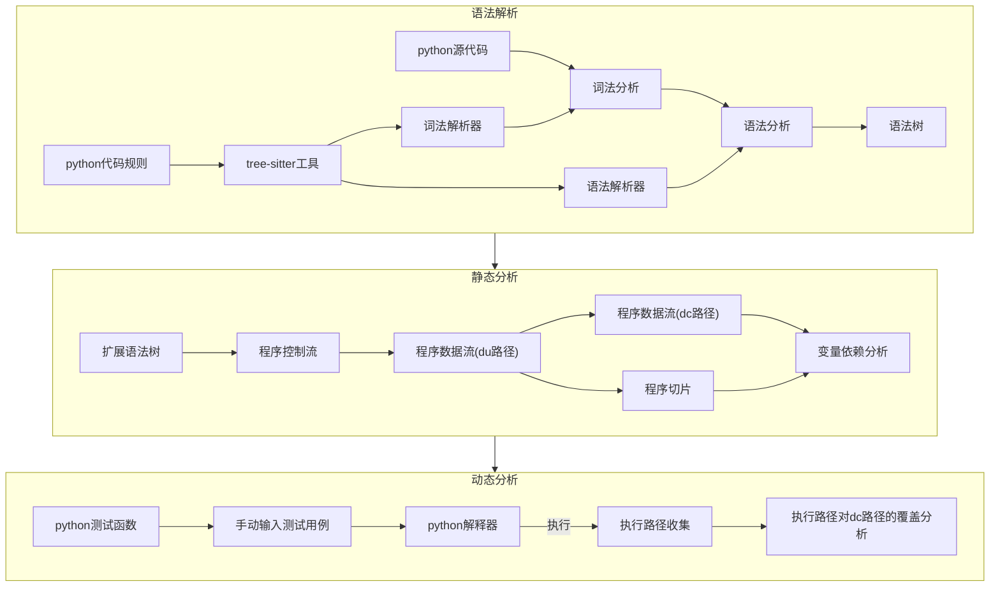
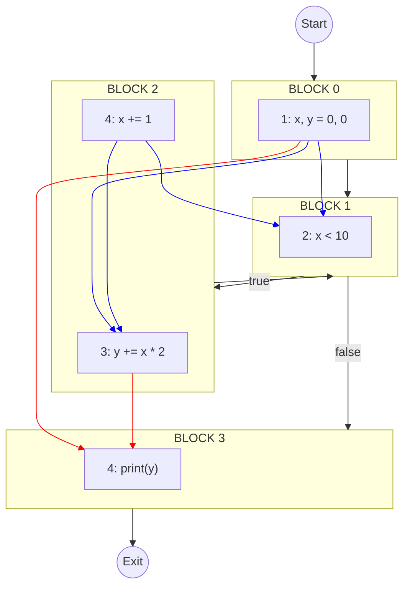
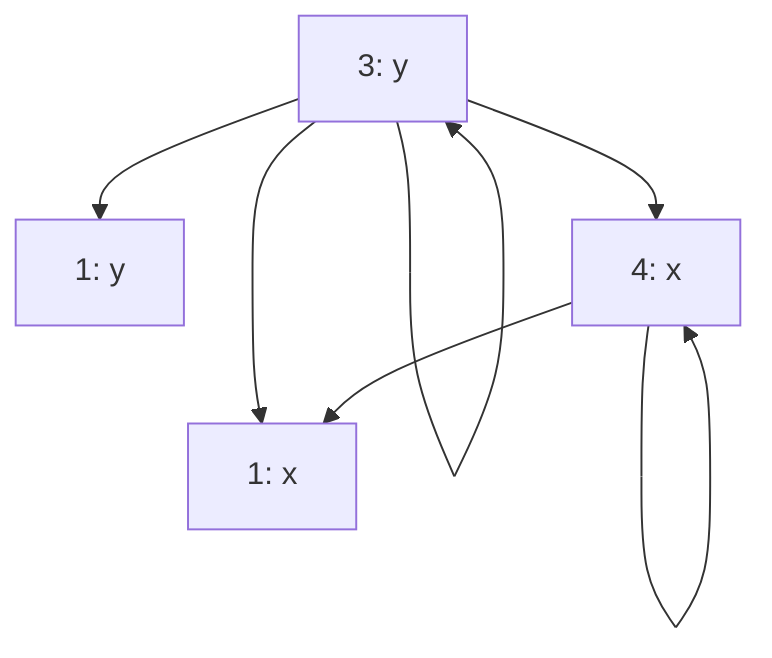

# 数据流和切片测试工具<br/>的设计与实现<br/>

北京航空航天大学软件学院

答辩人：阮中秋

指导老师：贾经冬

2024.5.27

---

# 项目背景及研究意义

<div class="grid grid-cols-2 gap-x-4">
  <div>

  ### 课题来源

  <div class="pl-8">

  由指导教师根据课程假设提出

  </div>
  <br>

  ### 项目背景与难点

  - 源自编译代码优化，属于<span class="text-red-500 font-semibold">白盒测试</span>

  - 当前提供完整数据流和切片测试功能的工具<span class="text-red-500 font-semibold">不存在</span>

  - 实际应用多为<span class="text-red-500 font-semibold">静态分析</span>

  </div>

  <div>

  ### 研究意义

  - 软件测试的重要性：产品质量，用户体验，软件安全，更高利润，生成效率等

  - 数据流和切片测试工具稀缺

  - 帮助学生学习理解数据流和切片测试

  </div>

</div>

---

# 研究目标和内容

<style>
  p {
    line-height: 2;
  }
</style>

<div class="grid grid-cols-3 gap-x-12">

  <div class="col-span-1">

  ### 研究目标

  基于数据流和切片测试思想，设计开发一个工具，能实现python程序分析和结果可视化、代码高亮、覆盖标准分析等功能，帮助学生理解数据流和切片测试的知识

  </div>

<div class="col-span-2">

  ### 研究内容概览

  <div class="grid grid-cols-2 gap-y-4  mt-5">

  <div class="text-center">

  

  ##### 控制流

  </div>

  <div class="text-center">

  

  ##### 数据流

  </div>

  <div class="text-center">

  

  ##### 程序切片高亮

  </div>

  <div class="text-center">

  

  ##### 覆盖标准分析

  </div>

</div>

</div>

</div>

---

# 概要设计——架构与技术

<div class="grid grid-cols-3 gap-x-4">

<div class="col-span-2">

### 架构设计


</div>

<div>

### 技术概览

<div class="grid grid-cols-3 gap-2 mt-4 border shadow-lg p-1">
<div class="col-span-1 text-center">

<logos-electron class="text-3xl" />

##### Electron

</div>

<div class="col-span-2 text-center self-center underline decoration-sky-500 underline-offset-4 decoration-2">

##### 跨平台桌面应用开发框架

</div>

</div>

<div class="grid grid-cols-3 gap-2 mt-4 border shadow-lg p-1">
<div class="col-span-1 text-center">

<logos-react class="text-3xl" />

##### React

</div>

<div class="col-span-2 text-center self-center underline decoration-sky-500 underline-offset-4 decoration-2">

##### 用于构建交互界面的库

</div>

</div>

<div class="grid grid-cols-3 gap-2 mt-4 border shadow-lg p1">
<div class="col-span-1 text-center">


##### Tree-Sitter

</div>

<div class="col-span-2 text-center self-center underline decoration-sky-500 underline-offset-4 decoration-2">

##### 语法解析器生成器工具

</div>

</div>

<div class="grid grid-cols-3 gap-2 mt-4 border shadow-lg p1">
<div class="col-span-1 text-center">


##### Mermaid

</div>

<div class="col-span-2 text-center self-center underline decoration-sky-500 underline-offset-4 decoration-2">

##### 基于JS的制图工具

</div>

</div>

</div>

</div>

---
level:2
---

# 概要设计——功能实现逻辑概览

<div class="w-full flex justify-center">



</div>

---

# 控制流——功能实现

<div class="grid grid-cols-3 gap-x-4">

  <div class="col-span-2">

  ### 时序图

  

  </div>

  <div>
  
  ### 控制流图

  <div class="grid grid-cols-4 mt-4">

  <div class="text-center self-center">
    <Marker class="text-blue-400">none</Marker>
  </div>

  <div class="text-center self-center">
    <Marker class="text-blue-400">if</Marker>
  </div>

  <div class="text-center self-center">
    <Marker class="text-blue-400">loop</Marker>
  </div>

  <div class="text-center self-center">
    <Marker class="text-blue-400">break</Marker>
  </div>
  
  </div>

  
  
  </div>

</div>


---

# 控制流——Dominance Frontiers

<arrow x1="330" y1="200" x2="380" y2="200" color="#953"/>

<arrow x1="545" y1="200" x2="580" y2="200" color="#953"/>

<arrow x1="720" y1="200" x2="760" y2="200" color="#953"/>

<div class="grid grid-cols-5 mb-4 -ml-12">


<div class="self-center mx-auto">

```ts
{
  type: 'assign',
  op: '=',
  sources: [],
  targets: [],
  location: {}
  parent: {},
  next_sibling: {},
  last_sibling: {},
}
```

</div>


</div>

<div class="shadow-lg">

| | $B_0$ | $B_1$ | $B_2$ | $B_3$ | $B_4$ | $B_5$ | $B_6$ | $B_7$ | $B_8$ |
|---|---|---|---|---|---|---|---|---|---|
| DOM | \{0\} | \{0,1\} | \{0,1,2\} | \{0,1,3\} | \{0,1,3,4\} | \{0,1,5\} | \{0,1,5,6\} | \{0,1,5,7\} | \{0,1,5,8\} |
| IDOM | - | 0 | 1 | 1 | 3 | 1 | 5 | 5 | 5 |
| DF | $\emptyset$ | \{$B_1$\} | \{$B_3$\} | \{$B_1$\} | $\emptyset$ | \{$B_3$\} | \{$B_7$\} | \{$B_3$\} | \{$B_7$\} |

</div>

---

# 数据流——功能实现

<div class="grid grid-cols-2 gap-x-4">

<div>

### 时序图


</div>

<div>

### dc路径图

- dc路径图 = 控制流图 + dc路径

<arrow x1="635" y1="330" x2="670" y2="330" color="#953"/>

<div class="grid grid-cols-3 gap-x-4 -mt-8">

<div class="col-span-1 self-center">

```python
1: x, y = 0, 0
2: while x < 10:
3:   y += x * 2
4:   x += 1
5: print(y)
```

</div>


<div class="col-span-2">



</div>

</div>

</div>

</div>


---
layout: two-cols
---


::right::

# 程序切片

<div>
```python
1: sum = 0
2: diff_sum = 0
3: for i in range(min(len(A), len(B))):
4:     sum += A[i] + B[i]
5:     diff_sum += A[i] - B[i]
6: print(sum, diff_sum)
```
<h6>Slice of sum</h6>
```python
1: sum = 0
3: for i in range(min(len(A), len(B))):
4:     sum += A[i] + B[i]
6: print(sum, diff_sum)
```
<h6>Slice of diff_sum</h6>
```python
2: diff_sum = 0
3: for i in range(min(len(A), len(B))):
5:     diff_sum += A[i] - B[i]
6: print(sum, diff_sum)
```
</div>

---
layout: two-cols
layoutClass: gap-16
---

# 变量依赖

<div>

```python
1: x, y = 0, 0
2: while x < 10:
3:   y += x * 2
4:   x += 1
5: print(y)
```

</div>
<div>



</div>

::right::

# 覆盖分析

<div class="grid grid-cols-2 gap-5">
<div>
<h6>测试函数</h6>
<div>

```python
def func(limit):
  x, y = 0, 0
  while x < limit:
    y += x * 2
    x += 1
  print(y)
```

</div>
<h6>测试用例</h6>
<div>

| limit |
| ----- |
| 0     |
| 10    |

</div>
</div>

<div>
<h6>执行代码</h6>
```python
# main.py
def func(limit):
  x, y = 0, 0
  while x < limit:
    y += x * 2
    x += 1
  print(y)

func(0)
func(10)

````

<h6>运行</h6>

```shell
> python main.py
````

<h6>收集执行路径</h6>

```shell
1->2->3->4....
```

</div>

</div>

---

# UI设计

<div class="w-full flex justify-center">

</div>

<arrow  x1="110" y1="210" x2="175" y2="234" color="#953" width="2" arrowSize="1" />
<p class="absolute top-43 left-4 text-[#953] font-bold">文件管理区</p>

<arrow  x1="110" y1="380" x2="175" y2="404" color="#953" width="2" arrowSize="1" />
<p class="absolute top-85 left-8 text-[#953] font-bold">代码结构</p>

<arrow  x1="875" y1="100" x2="810" y2="124" color="#953" width="2" arrowSize="1" />
<p class="absolute top-17 right-10 text-[#953] font-bold">工具栏</p>

<arrow  x1="445" y1="80" x2="450" y2="204" color="#953" width="2" arrowSize="1" />
<p class="absolute top-5 left-100 text-[#953] font-bold">编辑窗口<br>(编辑+代码高亮)</p>

<arrow  x1="855" y1="260" x2="810" y2="274" color="#953" width="2" arrowSize="1" />
<p class="absolute top-57 right-5 text-[#953] font-bold">代码切片窗口</p>

<arrow  x1="865" y1="420" x2="800" y2="444" color="#953" width="2" arrowSize="1" />
<p class="absolute top-97 right-5 text-[#953] font-bold">可视化窗口</p>

---
layout: image
image: /images/usecfg.png
backgroundSize: contain
---

---
layout: image
image: /images/useslice.png
backgroundSize: contain
---

---
layout: image
image: /images/usedf.png
backgroundSize: contain
---

---
layout: image
image: /images/usetestcase.png
backgroundSize: contain
---

